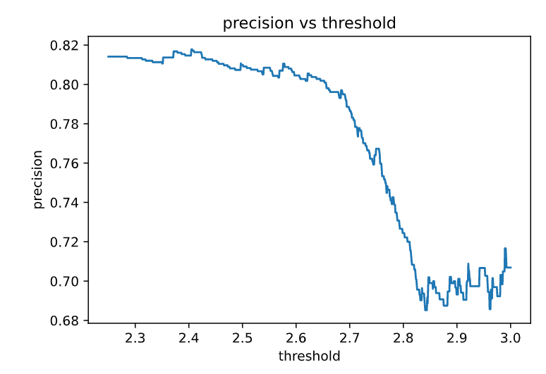

# 数据处理与分析

作者开放了使用的数据，并且已经划分成了训练集[train.csv][./data/train.csv]与测试集[test.csv][./data/test.csv]。每个数据有264维。有标签，值为1，2，3，4从低到高代表结晶情况从好到坏。

其中有32个feature取值为"Yes","No"，分别用数值1,0。其中一些feature中含有"?"表示参数不明，使用"?"为"Yes"的先验概率表示。
$$
\frac{\text{这一feature中Yes的数量}}{\text{Yes的数量+No的数量}}
$$
有6个feature取值为代表反应物名称的字符串，转换为独热编码。

其余feature取值为数值，不需要特殊处理。

由于数据大部分的feature都是直接由理论计算得到，不应当存在需要处理的异常值，因此不进行异常值的检测。事实上使用$z=\frac{z-\mu}{\sigma}$标准化后以$|z|<3$判定是否出现异常值，发现几乎所有特征都出现了异常值。数据本身不是正态分布，更接近于poisson分布，不应当因为偏离平均值过多而舍去。

作者希望发现新的反应物，因此要求划分测试集时将同一反应物组合的反应全部放在测试集或者训练集。因此我们按照反应物组合将训练集数据分组。从中训练集划分出验证集时随机抽取反应物组合，再得到相应的数据。

结果保存在[Xx.npy][./processedData/Xx.npy]，[Y.npy][./processedData/Y.npy], [y.npy][./processedData/y.npy]

作者将标签为1，2的反应条件视作失败反应，标签为3，4视为成功反应。由此对训练集的标签比例作图。

可以看出，大部分反应成功，类别明显不均衡。

而测试集的数据更不均衡

对不同反应物类型的反应分组，得到每组中反应个数的分布如下。最大的一组由175个反应，绝大多数反应物组合的反应数目在20以下。

为了考察反应物类型对反应结果的影响，对每个反应物组合，所有反应中成功反应的比例。发现反应物名称对反应结果有重大影响。但是作者的意图是发现新反应，因此将反应物名称从特征中剔除。

# 模型选择

作者使用3折交叉验证进行模型选择，我们也同样使用。

作者使用了SVM，核函数为PUK。我们使用sklearn中的SVC进行了复现。并对数据进行标准化
$$
z=\frac{x-\mu}{\sigma}
$$
类别不均衡问题可以直接使用SVC的class_weight="balanced"解决。

作者在测试集上的结果为

混淆矩阵

|              | prediction 1 | prediction 0 |
| ------------ | ------------ | ------------ |
| true label 1 | 212          | 13           |
| true label 0 | 48           | 3            |

accuracy=81%

precision=81%

recall=93%

使用作者使用的PUK核函数，对不同的正则化强度（软间隔大小）进行实验，交叉验证的结果如下。

设C=10，得到支持向量机模型应用于测试集上，发现效果极差，混淆矩阵为

|              | prediction 1 | prediction 0 |
| ------------ | ------------ | ------------ |
| true label 1 | 225          | 0            |
| true label 0 | 51           | 0            |

accuracy =81%

precision=81%

recall=100%

但是这个模型是全然无用的，无法预测0。

这一模型在训练集上给出结果的混淆矩阵为

|              | prediction 1 | prediction 0 |
| ------------ | ------------ | ------------ |
| true label 1 | 2778         | 0            |
| true label 0 | 21           | 1173         |

并且尝试增大正则化强度（减小C）也不能提高0的特异性。

这说明测试集与训练集的数据分布显著不同。

使用其他核函数：

rbf核，3折交叉验证结果如下，recall与另外两条曲线重合。

使用C=100，得到的模型性能如下

|              | prediction 1 | prediction 0 |
| ------------ | ------------ | ------------ |
| true label 1 | 116          | 109          |
| true label 0 | 20           | 31           |

accuracy =53%

precision=85%

recall=51%

虽然这一模型的recall很低，但是precision非常高。由于实验代价比理论代价高，因此precision更为重要。

在测试过程中，我们发现了有趣的事实：直接使用successful/failed进行训练得到的CV值比使用1，2，3，4训练效果差。

但是更有趣的是在使用0，1作为标签后rbf核虽然CV值下降了，但是在测试集上的效果更好了。

|              | prediction 1 | prediction 0 |
| ------------ | ------------ | ------------ |
| true label 1 | 167          | 58           |
| true label 0 | 16           | 35           |

accuracy =73%

precision=91%

recall=74%

而PUK核性能没有提升。这一问题可能还是因为测试集的分布不同于训练集。

我们进一步想到，1，2，3，4这四个类别是有序的，而svm的one vs rest方法并不能利用这一有序性。因此我们改为直接拟合label，而不是分类。

我们采用线性模型：使用自带的normalize参数进行参数标准化，不考虑类别均衡问题。以2.5为阈值，如果预测值高于阈值则视为成功反应，反之视为失败反应。简单的线性拟合取得了良好的效果。

|              | prediction 1 | prediction 0 |
| ------------ | ------------ | ------------ |
| true label 1 | 188          | 37           |
| true label 0 | 44           | 7            |

accuracy =70%

precision=81%

recall=83%

考虑到有大量特征，因此进行了正则化，尝试了Lasso回归，Ridge回归，Logistic回归。三折交叉验证计算不同正则化强度下的得分，但是性能提升不大。

尝试通过斜率的大小判定一个参数,但是观察到Lasso回归性能在正则化强度很高时性能下降，说明将斜率小的因素忽略会引发问题。

使用性能高而且稳定的C=0.1的岭回归对测试集进行预测。

|              | prediction 1 | prediction 0 |
| ------------ | ------------ | ------------ |
| true label 1 | 196          | 29           |
| true label 0 | 46           | 5            |

accuracy =72%

precision=81%

recall=87%

与简单的线性回归差别不大

尝试调整阈值，作出预测值分布的直方图

阈值可以在2.25到3.00之间条件，由于我们在意的是precision，因此不做出ROC曲线而是作出precision随阈值变化的曲线。

出人意料的是阈值越大测试集上的precision越低，但是在验证集上没有这个问题。

降维后回归??

# 参考文献的分析

作者从实验室笔记本中收集了水热合成反应的信息，并使用商业软件添加了使用反应物名称计算得到的物理化学性质（比如有机反应物的配体分子量，氢键给体受体数，极性表面积，无机反应物的电离能，电子亲合能，电负性，硬度，原子半径，元素周期表中的位置)。数据的标签取值为1，2，3，4从小到大代表结晶结果从坏到好。以反应产生单晶或多晶为成功（3，4），反之为失败。

以此训练机器学习模型来预测新反应的结果。虽然训练时的标签分为4类，但是评估模型时将分类结果化为成功与失败。

使用支持向量机（Pearson VII核）用来预测新的反应精度为89%，超过了人类直觉（精度为78%）。

支持向量机不具有可解释性，将其预测结果用决策树模型拟合，得到了反应成功需要的条件。

亮点在于利用了一直被忽视的失败数据。但是研究方法并不先进，使用了最简单的支持向量机模型并且没有对参数比如软间隔大小，核函数的影响进行分析，也没有进行类别平衡。用分类树得到了化学直觉。

问题：70%的成功率如何能称为失败反应??。

测试集上89%的成功率究竟是如何计算的，究竟测试集是如何生成的, 如何保证探索的都是模型有把握的。The 89% success rate of the model in the experimental test is greater than the test-set accuracy measured during model construction, because the train/test split on the historical data essentially tests only exploration reactions (for which the model uncertainty is higher), whereas these experiments test exploitation reactions (for which the model uncertainty is lower).

为何不直接用分类树拟合实验结果而是拟合SVM的结果。

可以用委员会给出成功的概率，并进行探索与利用的平衡，而不是像文献中的利用新反应物与已有反应物的相似程度来探索。

